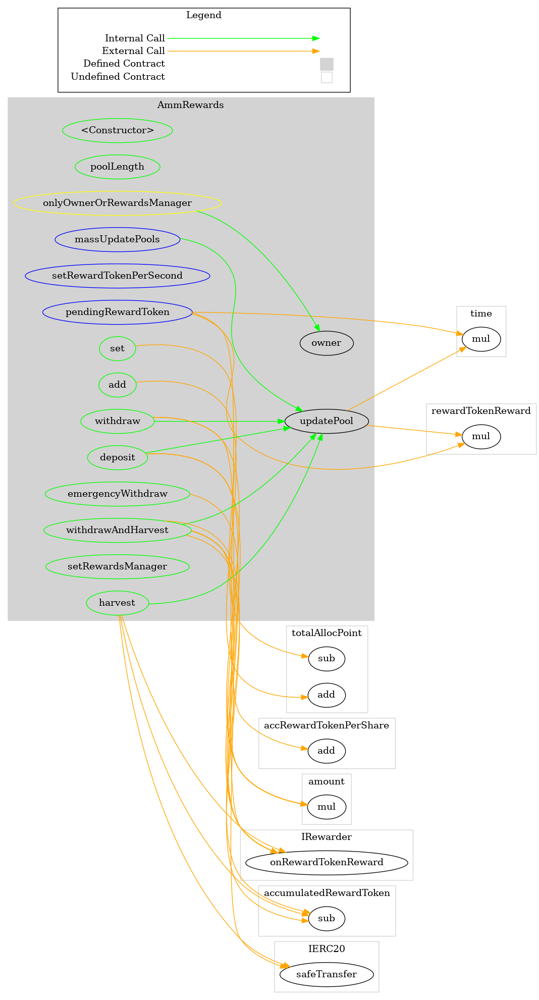
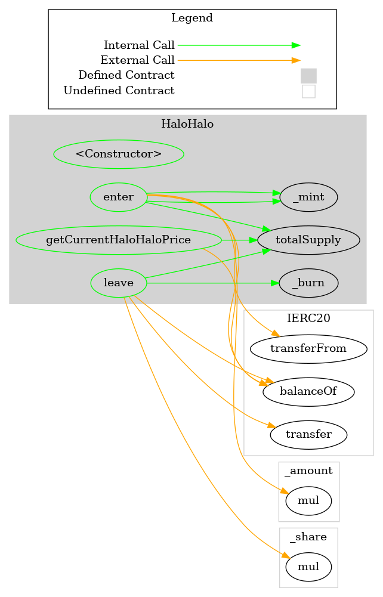
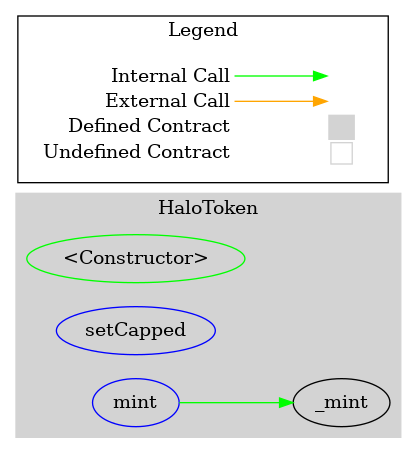
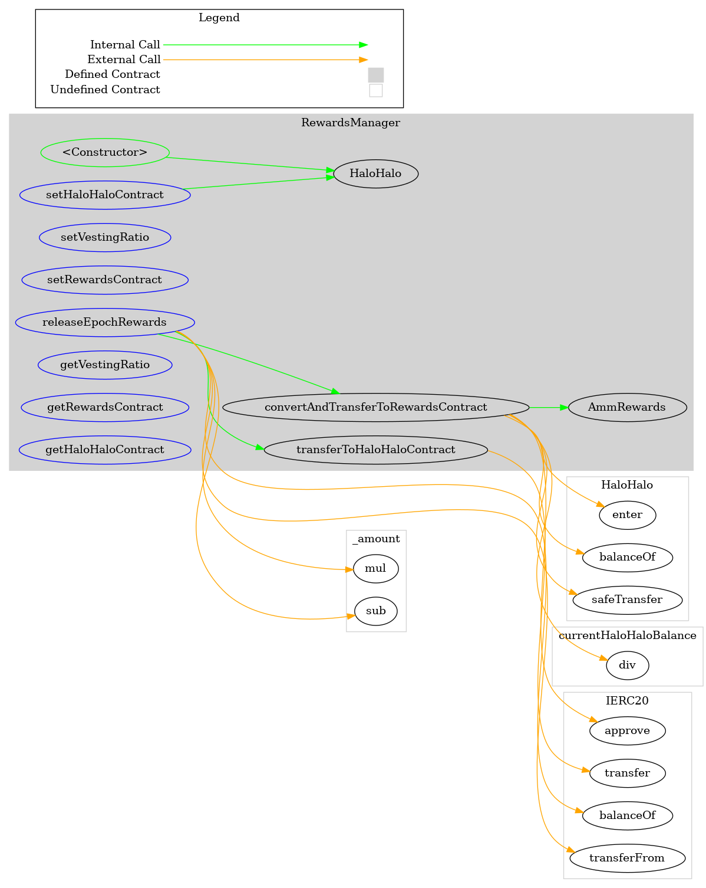
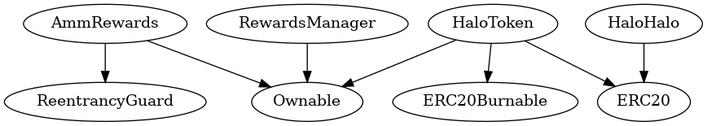

<div id="splash">
    <div id="project">
          <span class="splash-title">
               Project
          </span>
          <br />
          <span id="project-value">
               Halo Rewards
          </span>
    </div>
     <div id="details">
          <div id="left">
               <span class="splash-title">
                    Client
               </span>
               <br />
               <span class="details-value">
                    Halo DAO
               </span>
               <br />
               <span class="splash-title">
                    Date
               </span>
               <br />
               <span class="details-value">
                    June 2021
               </span>
          </div>
          <div id="right">
               <span class="splash-title">
                    Reviewers
               </span>
               <br />
               <span class="details-value">
                    Daniel Luca
               </span><br />
               <span class="contact">@cleanunicorn</span>
               <br />
               <span class="details-value">
                    Andrei Simion
               </span><br />
               <span class="contact">@andreiashu</span>
          </div>
    </div>
</div>


## Table of Contents
 - [Details](#details)
 - [Issues Summary](#issues-summary)
 - [Executive summary](#executive-summary)
     - [Week 1](#week-1)
 - [Scope](#scope)
 - [Recommendations](#recommendations)
 - [Issues](#issues)
     - [Consider checking for duplicate LP tokens when adding a new one in AmmRewards](#consider-checking-for-duplicate-lp-tokens-when-adding-a-new-one-in-ammrewards)
     - [Capping the minting process can be simplified](#capping-the-minting-process-can-be-simplified)
     - [haloHaloAmount should be renamed to haloAmount](#halohaloamount-should-be-renamed-to-haloamount)
     - [Can set immutable for halo in HaloHalo](#can-set-immutable-for-halo-in-halohalo)
     - [The number of minted tokens might not be the expected one](#the-number-of-minted-tokens-might-not-be-the-expected-one)
 - [Artifacts](#artifacts)
     - [Surya](#surya)
     - [Coverage](#coverage)
     - [Tests](#tests)
 - [License](#license)


## Details

- **Client** Halo DAO
- **Date** June 2021
- **Lead reviewer** Daniel Luca ([@cleanunicorn](https://twitter.com/cleanunicorn))
- **Reviewers** Daniel Luca ([@cleanunicorn](https://twitter.com/cleanunicorn)), Andrei Simion ([@andreiashu](https://twitter.com/andreiashu))
- **Repository**: [Halo Rewards](https://github.com/HaloDAO/halo-rewards.git)
- **Commit hash** `1cff704a4065256f30bb50858626aa7ef5552268`
- **Technologies**
  - Solidity
  - Node.JS

## Issues Summary

| SEVERITY | OPEN  | CLOSED |
| -------- | :---: | :----: |
|  Informational  |  1  |  0  |
|  Minor  |  3  |  0  |
|  Medium  |  1  |  0  |
|  Major  |  0  |  0  |

## Executive summary

This report represents the results of the engagement with **Halo DAO** to review **Halo Rewards**.

The review was conducted over the course of **1 week** from **October 15 to November 15, 2020**. A total of **5 person-days** were spent reviewing the code.

### Week 1

During the first week, we ...

## Scope

The initial review focused on the [Halo Rewards](https://github.com/HaloDAO/halo-rewards.git) repository, identified by the commit hash `1cff704a4065256f30bb50858626aa7ef5552268`. ...

<!-- We focused on manually reviewing the codebase, searching for security issues such as, but not limited to, re-entrancy problems, transaction ordering, block timestamp dependency, exception handling, call stack depth limitation, integer overflow/underflow, self-destructible contracts, unsecured balance, use of origin, costly gas patterns, architectural problems, code readability. -->

**Includes:**
- HaloHalo.sol
- HaloToken.sol
- AmmRewards.sol
- RewardsManager.sol

## Recommendations

We identified a few possible general improvements that are not security issues during the review, which will bring value to the developers and the community reviewing and using the product.

<!-- ### Increase the number of tests

A good rule of thumb is to have 100% test coverage. This does not guarantee the lack of security problems, but it means that the desired functionality behaves as intended. The negative tests also bring a lot of value because not allowing some actions to happen is also part of the desired behavior.

-->

## Issues


### [Consider checking for duplicate LP tokens when adding a new one in `AmmRewards`](https://github.com/monoceros-alpha/review-halodao-rewards-2021-06/issues/5)
 

**Description**

An owner can add a new LP token to the list by calling `add`.


[code/contracts/AmmRewards.sol#L85](https://github.com/monoceros-alpha/review-halodao-rewards-2021-06/blob/4757f51facd18a0fa205ffd9961df8c6b0409deb/code/contracts/AmmRewards.sol#L85)
```solidity
    function add(uint256 allocPoint, IERC20 _lpToken, IRewarder _rewarder) public onlyOwner {
```

There's a comment stating that rewards will suffer if the same LP token is added multiple times in the list.


[code/contracts/AmmRewards.sol#L81](https://github.com/monoceros-alpha/review-halodao-rewards-2021-06/blob/4757f51facd18a0fa205ffd9961df8c6b0409deb/code/contracts/AmmRewards.sol#L81)
```solidity
    /// DO NOT add the same LP token more than once. Rewards will be messed up if you do.
```

Consider checking for duplicate tokens when adding a new one to make sure the system does not behave incorrectly.

**Recommendation**

If the number of tokens will not be over 10, consider looping over the existing tokens, making sure the new token does not match one of the existing ones.

```solidity
contract CheckWithLoop {
    uint[] list;

    function addLoop(uint n) public {
        uint listLength = list.length;
        for (uint i; i < listLength; i++) {
            require(list[i] != n, "no duplicates");
        }
        list.push(n);
    }
}
```

If you expect to have more than 10 tokens on the list, a mapping can be used to check the existence of a token.

```solidity
contract CheckWithMapping {
    uint[] list;
    mapping(uint => bool) listDups;
    
    function addNonDuplicate(uint n) public {
        require(listDups[n] == false, "no duplicates");
        list.push(n);
        listDups[n] = true;
    }
}
```


---


### [Capping the minting process can be simplified](https://github.com/monoceros-alpha/review-halodao-rewards-2021-06/issues/4)
 

**Description**

When the HaloToken is deployed, there are 2 state variables set:


[code/contracts/HaloToken.sol#L24-L25](https://github.com/monoceros-alpha/review-halodao-rewards-2021-06/blob/4757f51facd18a0fa205ffd9961df8c6b0409deb/code/contracts/HaloToken.sol#L24-L25)
```solidity
        canMint = true;
        isCappedFuncLocked = false;
```

The `canMint` state variable is checked when the owner tries to mint additional tokens.


[code/contracts/HaloToken.sol#L40-L41](https://github.com/monoceros-alpha/review-halodao-rewards-2021-06/blob/4757f51facd18a0fa205ffd9961df8c6b0409deb/code/contracts/HaloToken.sol#L40-L41)
```solidity
    function mint(address account, uint256 amount) external onlyOwner {
        require(canMint == true, "Total supply is now capped, cannot mint more");
```

The owner can renounce this power by calling `setCapped`.


[code/contracts/HaloToken.sol#L28-L30](https://github.com/monoceros-alpha/review-halodao-rewards-2021-06/blob/4757f51facd18a0fa205ffd9961df8c6b0409deb/code/contracts/HaloToken.sol#L28-L30)
```solidity
    /// @notice Locks the cap and disables mint func.
    /// @dev Should be called only once. Allows owner to lock the cap and disable mint function.
    function setCapped() external onlyOwner {
```

When `setCapped` is called, the state variable `isCappedFuncLocked` is checked to be false.


[code/contracts/HaloToken.sol#L31](https://github.com/monoceros-alpha/review-halodao-rewards-2021-06/blob/4757f51facd18a0fa205ffd9961df8c6b0409deb/code/contracts/HaloToken.sol#L31)
```solidity
        require(isCappedFuncLocked == false, "Cannot execute setCapped more than once.");
```

Once the check passes, `canMint` is set to `false`, blocking future token minting.


[code/contracts/HaloToken.sol#L32](https://github.com/monoceros-alpha/review-halodao-rewards-2021-06/blob/4757f51facd18a0fa205ffd9961df8c6b0409deb/code/contracts/HaloToken.sol#L32)
```solidity
        canMint = false;
```

And `isCappedFuncLocked` is set to `true`; this prevents a second call to `setCapped`.

However, the 2 state variables are always synchronized. They can have the value `true` or `false`. And they only exist in these 2 states:

1. Can mint tokens; can disable token minting
```
canMint = true
isCappedFuncLocked = false
```

2. Cannot mint tokens anymore; cannot re-enable token minting
```
canMint = false
isCappedFuncLocked = true
```

The code can be simplified if one of the 2 state variables is removed, the other one's value can be deduced by negating the remaining one.

**Recommendation**

Remove `isCappedFuncLocked` and use `canMint` to limit the `setCapped` execution.


---


### [`haloHaloAmount` should be renamed to `haloAmount`](https://github.com/monoceros-alpha/review-halodao-rewards-2021-06/issues/3)
 

**Description**

When a user wants to unstake their tokens, they need to call `leave`.


[code/contracts/HaloHalo.sol#L44-L46](https://github.com/monoceros-alpha/review-halodao-rewards-2021-06/blob/625eb4d3d0f780cfe06bb3f44ccbbea37149bd8b/code/contracts/HaloHalo.sol#L44-L46)
```solidity
  // Claim HALOs from HALOHALOs.
  // Unlocks the staked + gained Halo and burns HALOHALO
  function leave(uint256 _share) public {
```

The amount of tokens to be unlocked is calculated and saved in a local variable `haloHaloAmount`:


[code/contracts/HaloHalo.sol#L49-L51](https://github.com/monoceros-alpha/review-halodao-rewards-2021-06/blob/625eb4d3d0f780cfe06bb3f44ccbbea37149bd8b/code/contracts/HaloHalo.sol#L49-L51)
```solidity
    // Calculates the amount of Halo the HALOHALO is worth
    uint256 haloHaloAmount =
      _share.mul(halo.balanceOf(address(this))).div(totalShares);
```

This value should be named `haloAmount` because this value is then used to send the halo tokens back to the user.


[code/contracts/HaloHalo.sol#L53](https://github.com/monoceros-alpha/review-halodao-rewards-2021-06/blob/625eb4d3d0f780cfe06bb3f44ccbbea37149bd8b/code/contracts/HaloHalo.sol#L53)
```solidity
    halo.transfer(msg.sender, haloHaloAmount);
```

**Recommendation**

Rename the variable `haloHaloAmount` to `haloAmount`.


---


### [Can set immutable for `halo` in `HaloHalo`](https://github.com/monoceros-alpha/review-halodao-rewards-2021-06/issues/1)
 

**Description**

The Halo token contract is set when the `HaloHalo` contract is deployed.


[code/contracts/HaloHalo.sol#L16](https://github.com/monoceros-alpha/review-halodao-rewards-2021-06/blob/625eb4d3d0f780cfe06bb3f44ccbbea37149bd8b/code/contracts/HaloHalo.sol#L16)
```solidity
    halo = _halo;
```

The `halo` variable is defined as a state variable.


[code/contracts/HaloHalo.sol#L10](https://github.com/monoceros-alpha/review-halodao-rewards-2021-06/blob/625eb4d3d0f780cfe06bb3f44ccbbea37149bd8b/code/contracts/HaloHalo.sol#L10)
```solidity
  IERC20 public halo;
```

Because this state variable is never changed, it can be defined as `immutable` for a significant gas cost.

**Recommendation**

Set `halo` as `immutable`.


---


### [The number of minted tokens might not be the expected one](https://github.com/monoceros-alpha/review-halodao-rewards-2021-06/issues/2)
 

**Description**

A user can stake HALO tokens for HALOHALO tokens by calling the `enter` method.


[code/contracts/HaloHalo.sol#L23](https://github.com/monoceros-alpha/review-halodao-rewards-2021-06/blob/625eb4d3d0f780cfe06bb3f44ccbbea37149bd8b/code/contracts/HaloHalo.sol#L23)
```solidity
  function enter(uint256 _amount) public {
```

The number of HALO tokens is retrieved:


[code/contracts/HaloHalo.sol#L27-L28](https://github.com/monoceros-alpha/review-halodao-rewards-2021-06/blob/625eb4d3d0f780cfe06bb3f44ccbbea37149bd8b/code/contracts/HaloHalo.sol#L27-L28)
```solidity
    // Gets the amount of Halo locked in the contract
    uint256 totalHalo = halo.balanceOf(address(this));
```

Next, the total number of shares is retrieved, which matches the number of minted tokens:


[code/contracts/HaloHalo.sol#L29-L30](https://github.com/monoceros-alpha/review-halodao-rewards-2021-06/blob/625eb4d3d0f780cfe06bb3f44ccbbea37149bd8b/code/contracts/HaloHalo.sol#L29-L30)
```solidity
    // Gets the amount of HALOHALO in existence
    uint256 totalShares = totalSupply();
```

If this is the first time someone enters the stake, the conditional is true, and a ratio of 1:1 is minted based on the amount entering the contract.


[code/contracts/HaloHalo.sol#L31-L33](https://github.com/monoceros-alpha/review-halodao-rewards-2021-06/blob/625eb4d3d0f780cfe06bb3f44ccbbea37149bd8b/code/contracts/HaloHalo.sol#L31-L33)
```solidity
    // If no HALOHALO exists, mint it 1:1 to the amount put in
    if (totalShares == 0 || totalHalo == 0) {
      _mint(msg.sender, _amount);
```

i.e., An actor entering with 100 HALO tokens will receive 100 HALOHALO tokens.

If tokens were already minted and HALO tokens exist in the contract, a formula is used to calculate how many tokens should be minted.


[code/contracts/HaloHalo.sol#L35-L37](https://github.com/monoceros-alpha/review-halodao-rewards-2021-06/blob/625eb4d3d0f780cfe06bb3f44ccbbea37149bd8b/code/contracts/HaloHalo.sol#L35-L37)
```solidity
      // Calculate and mint the amount of HALOHALO the Halo is worth. The ratio will change overtime, as HALOHALO is burned/minted and Halo deposited from LP rewards.
      uint256 haloHaloAmount = _amount.mul(totalShares).div(totalHalo);
      _mint(msg.sender, haloHaloAmount);
```

Let's assume an actor is the first one to stake tokens in the contract. They send 100 HALO tokens to the contact. Because they are the first ones, the contract mints 1:1 tokens, effectively 100 HALOHALO tokens.

The second actor enters with 100 HALO too. This time, the formula is activated.

$hh_{amount} = \frac{h_{enter} * hh_{minted}}{h_{locked}}$

A number of $hh_{amount} = 100$ get minted. 

This is because the formula uses the amount of tokens which the user wants to lock ($h_{enter} = 100$), the number of tokens already minted ($hh_{minted} = 100$, from the previous user) and the total locked tokens in the contract ($h_{locked} = 100$).

minted tokens = $\frac{100 * 100}{100} = 100$

If everything works well, a ratio of 1:1 will always be respected. However, if anyone sends HALO tokens to the contract, the 1:1 ratio is forever changed for all users staking tokens.

Let's assume that after the 2 users deposited 100 HALO tokens each, and they received 100 HALOHALO tokens, a malicious user sends 100 HALO tokens to the contract without calling `enter`, but by using the `transfer` method.

We should be aware of the current state of the contract right now.

$hh_{minted} = 200$

$h_{locked} = 300$

The number of $h_{locked}$ is equal to 300 because the actual balance of the token is retrieved by using the `balanceOf` method, not an internal accounting method.

If a 3rd user wants to lock 100 HALO tokens, a different ratio of HALOHALO tokens will be minted for them. Using the formula we obtain the number of minted tokens.

Minted tokens = $\frac{100 * 200}{300} = 66.66$

This allows a malicious actor to manipulate the ratio of minted tokens.

It's important to note that the "unstake" mechanism is not affected in any detrimental way because the current ratio is used to return the tokens back to the users.


---


## Artifacts

### Surya

Sūrya is a utility tool for smart contract systems. It provides a number of visual outputs and information about the structure of smart contracts. It also supports querying the function call graph in multiple ways to aid in the manual inspection and control flow analysis of contracts.

**Files Description Table**

| File Name            | SHA-1 Hash                               |
| -------------------- | ---------------------------------------- |
| ./AmmRewards.sol     | 49b19808853abe8c5c8bfb439d83ee196314a616 |
| ./HaloHalo.sol       | 4d1f4fa884b7499e9ab33fcb423b88ea05ac2242 |
| ./HaloToken.sol      | aadb215941a561bc6f3005d0f19a09a7775476bf |
| ./RewardsManager.sol | c0ee996398307a8e777783f8b1b1ef22af2e11c1 |

**Contracts Description Table**

|      Contract      |                Type                 |             Bases             |                |                           |
| :----------------: | :---------------------------------: | :---------------------------: | :------------: | :-----------------------: |
|         └          |          **Function Name**          |        **Visibility**         | **Mutability** |       **Modifiers**       |
|                    |                                     |                               |                |                           |
|   **AmmRewards**   |           Implementation            |   ReentrancyGuard, Ownable    |                |                           |
|         └          |            <Constructor>            |           Public ❗️            |       🛑        |            NO❗️            |
|         └          |             poolLength              |           Public ❗️            |                |            NO❗️            |
|         └          |                 add                 |           Public ❗️            |       🛑        |         onlyOwner         |
|         └          |                 set                 |           Public ❗️            |       🛑        |         onlyOwner         |
|         └          |       setRewardTokenPerSecond       |          External ❗️           |       🛑        | onlyOwnerOrRewardsManager |
|         └          |         pendingRewardToken          |          External ❗️           |                |            NO❗️            |
|         └          |           massUpdatePools           |          External ❗️           |       🛑        |            NO❗️            |
|         └          |             updatePool              |           Public ❗️            |       🛑        |            NO❗️            |
|         └          |               deposit               |           Public ❗️            |       🛑        |            NO❗️            |
|         └          |              withdraw               |           Public ❗️            |       🛑        |            NO❗️            |
|         └          |               harvest               |           Public ❗️            |       🛑        |            NO❗️            |
|         └          |         withdrawAndHarvest          |           Public ❗️            |       🛑        |            NO❗️            |
|         └          |          emergencyWithdraw          |           Public ❗️            |       🛑        |            NO❗️            |
|         └          |          setRewardsManager          |           Public ❗️            |       🛑        |         onlyOwner         |
|                    |                                     |                               |                |                           |
|    **HaloHalo**    |           Implementation            |             ERC20             |                |                           |
|         └          |            <Constructor>            |           Public ❗️            |       🛑        |            NO❗️            |
|         └          |                enter                |           Public ❗️            |       🛑        |            NO❗️            |
|         └          |                leave                |           Public ❗️            |       🛑        |            NO❗️            |
|         └          |       getCurrentHaloHaloPrice       |           Public ❗️            |                |            NO❗️            |
|                    |                                     |                               |                |                           |
|   **HaloToken**    |           Implementation            | ERC20, ERC20Burnable, Ownable |                |                           |
|         └          |            <Constructor>            |           Public ❗️            |       🛑        |           ERC20           |
|         └          |              setCapped              |          External ❗️           |       🛑        |         onlyOwner         |
|         └          |                mint                 |          External ❗️           |       🛑        |         onlyOwner         |
|                    |                                     |                               |                |                           |
| **RewardsManager** |           Implementation            |            Ownable            |                |                           |
|         └          |            <Constructor>            |           Public ❗️            |       🛑        |            NO❗️            |
|         └          |         releaseEpochRewards         |          External ❗️           |       🛑        |         onlyOwner         |
|         └          |           setVestingRatio           |          External ❗️           |       🛑        |         onlyOwner         |
|         └          |         setRewardsContract          |          External ❗️           |       🛑        |         onlyOwner         |
|         └          |         setHaloHaloContract         |          External ❗️           |       🛑        |         onlyOwner         |
|         └          |           getVestingRatio           |          External ❗️           |                |            NO❗️            |
|         └          |         getRewardsContract          |          External ❗️           |                |            NO❗️            |
|         └          |         getHaloHaloContract         |          External ❗️           |                |            NO❗️            |
|         └          |     transferToHaloHaloContract      |          Internal 🔒           |       🛑        |                           |
|         └          | convertAndTransferToRewardsContract |          Internal 🔒           |       🛑        |                           |

**Legend**

| Symbol | Meaning                   |
| :----: | ------------------------- |
|   🛑    | Function can modify state |
|   💵    | Function is payable       |

#### Graphs

***AmmRewards***

```text
surya graph AmmRewards.sol | dot -Tpng > ./static/AmmRewards_graph.png
```



***HaloHalo***

```text
surya graph HaloHalo.sol | dot -Tpng > ./static/HaloHalo_graph.png
```



***HaloToken***

```text
surya graph HaloToken.sol | dot -Tpng > ./static/HaloToken_graph.png
```



***RewardsManager***

```text
surya graph RewardsManager.sol | dot -Tpng > ./static/RewardsManager_graph.png
```



#### Inheritance



#### Describe

```text
$ npx surya describe *.sol                                   

 +  AmmRewards (ReentrancyGuard, Ownable)
    - [Pub] <Constructor> #
    - [Pub] poolLength
    - [Pub] add #
       - modifiers: onlyOwner
    - [Pub] set #
       - modifiers: onlyOwner
    - [Ext] setRewardTokenPerSecond #
       - modifiers: onlyOwnerOrRewardsManager
    - [Ext] pendingRewardToken
    - [Ext] massUpdatePools #
    - [Pub] updatePool #
    - [Pub] deposit #
    - [Pub] withdraw #
    - [Pub] harvest #
    - [Pub] withdrawAndHarvest #
    - [Pub] emergencyWithdraw #
    - [Pub] setRewardsManager #
       - modifiers: onlyOwner

 +  HaloHalo (ERC20)
    - [Pub] <Constructor> #
    - [Pub] enter #
    - [Pub] leave #
    - [Pub] getCurrentHaloHaloPrice

 +  HaloToken (ERC20, ERC20Burnable, Ownable)
    - [Pub] <Constructor> #
       - modifiers: ERC20
    - [Ext] setCapped #
       - modifiers: onlyOwner
    - [Ext] mint #
       - modifiers: onlyOwner

 +  RewardsManager (Ownable)
    - [Pub] <Constructor> #
    - [Ext] releaseEpochRewards #
       - modifiers: onlyOwner
    - [Ext] setVestingRatio #
       - modifiers: onlyOwner
    - [Ext] setRewardsContract #
       - modifiers: onlyOwner
    - [Ext] setHaloHaloContract #
       - modifiers: onlyOwner
    - [Ext] getVestingRatio
    - [Ext] getRewardsContract
    - [Ext] getHaloHaloContract
    - [Int] transferToHaloHaloContract #
    - [Int] convertAndTransferToRewardsContract #


 ($) = payable function
 # = non-constant function
 ```

### Coverage

<!-- ```text
$ npm run coverage
``` -->

### Tests

```text
$ yarn run test
yarn run v1.22.10
warning package.json: No license field
$ npx hardhat --network localhost test
BASIS_POINTS =  10000

  Amm Rewards
    PoolLength
      ✓ PoolLength should execute (187308 gas)
    Set
      ✓ Should emit event LogSetPool (285027 gas)
      ✓ Should revert if invalid pool
    Pending Reward Token
      ✓ Pending Reward Token should equal Expected Reward Token (408378 gas)
      ✓ When time is lastRewardTime (408378 gas)
    MassUpdatePools
      ✓ Should call updatePool (234554 gas)
      ✓ Updating invalid pools should fail
    Add
      ✓ Should add pool with reward token multiplier (187308 gas)
    UpdatePool
      ✓ Should emit event LogUpdatePool (234463 gas)
    Deposit
      ✓ Depositing 0 amount (290613 gas)
      ✓ Depositing into non-existent pool should fail
    Withdraw
      ✓ Withdraw 0 amount (255423 gas)
    Harvest
      ✓ Should give back the correct amount of Reward Token (509159 gas)
      ✓ Harvest with empty user balance (246015 gas)
    EmergencyWithdraw
      ✓ Should emit event EmergencyWithdraw (365663 gas)
    Admin functions
      ✓ Non-owner should not be able to add pool
      ✓ Owner should be able to add pool (187308 gas)
      ✓ Non-owner should not be able to set pool allocs (187308 gas)
      ✓ Owner should be able to set pool allocs (231511 gas)
      ✓ Non-owner should not be able to set rewardTokenPerSecond
      ✓ Owner should be able to set rewardTokenPerSecond (32504 gas)
    Set rewardTokenPerSecond
      ✓ Non-owner should not be able to set rewardTokenPerSecond
      ✓ RewardsManager should change rewardTokenPerSecond (167779 gas)
      ✓ Owner should be able to set rewardTokenPerSecond (32504 gas)

  Halo Token
===================Deploying Contracts=====================
halo token deployed
Minted initial HALO for owner account
Minted initial HALO for addr1 account
    Check Contract Deployment
      ✓ HaloToken should be deployed (54478 gas)
    I should be able to transfer HALO tokens
      ✓ Allow transfer (89841 gas)
    I should be able to mint HALO tokens and get the correct totalSupply
      ✓ Only owner should mint (72741 gas)
5e+25  HALO tokens owner balance
      ✓ When owner mints, the total supply should be equal to all wallet balance (74756 gas)
    I should not be allowed to mint if capped is already locked
      ✓ Only owner can execute setCapped (64598 gas)
      ✓ Should revert mint when capped is locked (27220 gas)
      ✓ Should revert setCapped func if it has been executed more than once (27220 gas)
    I should be able to burn HALO tokens and get the correct totalSupply
      ✓ Only account holder should burn (61594 gas)
      ✓ Only owner should burn users tokens (144521 gas)
4e+25 HALO tokens owner balance
      ✓ When user burns, the total supply should be equal to all wallet balance (62005 gas)
      ✓ Burn amount should not exceed wallet balance (34374 gas)

  HALOHALO Contract
===================Deploying Contracts=====================
halo token deployed
40000000 HALO minted to 0x959FD7Ef9089B7142B6B908Dc3A8af7Aa8ff0FA1

halohalo deployed
==========================================================


    Check Contract Deployments
      ✓ HaloToken should be deployed (37402 gas)
      ✓ Halohalo should be deployed (37402 gas)
    Earn vesting rewards by staking HALO inside halohalo
      ✓ Genesis is zero (37402 gas)
      ✓ Deposit HALO tokens to halohalo contract to receive halohalo (190239 gas)
      ✓ Calculates current value of HALOHALO in terms of HALO without vesting (105873 gas)
      ✓ Calculates current value of HALOHALO in terms of HALO after vesting (143239 gas)
      ✓ Claim staked HALO + bonus rewards from Halohalo and burn halohalo (73308 gas)
Minting HALO to be entered in the halohalo contract..

Minting 100 HALO to User A...
Minting 100 HALO to User B...
Minting 100 HALO to User C...
100 HALO deposited by User A to halohalo
Simulate releasing vested bonus tokens to halohalo from Rewards contract #1
100 HALO deposited by User B to halohalo
Simulate releasing vested bonus tokens to halohalo from Rewards contract #2
100 HALO deposited by User C to halohalo
Transfer to 0xB0201641d9b936eB20155a38439Ae6AB07d85Fbd approved
All users leave halohalo
Address 0 left
Address 1 left
Address 2 left
      ✓ HALO earned by User A > HALO earned by User B > HALO earned by User C (754048 gas)

  Rewards Manager
===================Deploying Contracts=====================
collateralERC20 deployed
halo token deployed
halohalo deployed
changedHaloHaloContract deployed
Set Rewards Manager contract.
Deployed Rewards Manager Contract address: 0x2Cc79B6860Fd7b58f0Fb56B4f448c13C7e898EC4
==========================================================


    Check Contract Deployments
      ✓ HaloToken should be deployed (46340 gas)
      ✓ Halohalo should be deployed (46340 gas)
      ✓ Lptoken should be deployed (46340 gas)
      ✓ Rewards Management Contract should be deployed (46340 gas)
    Admin functions can be set by the owner
      ✓ can set the vestingRatio if the caller is the owner (75061 gas)
      ✓ can not set the vestingRatio if the caller is not the owner (28636 gas)
      ✓ can not set the vesting ratio if vesting ratio is equal to zero (28636 gas)
      ✓ can set the rewards contract if the caller is the owner (57691 gas)
      ✓ can not set the rewards contract if the caller is not the owner (28636 gas)
      ✓ can not set the rewards contract if address parameter is address(0) (28636 gas)
      ✓ can set the halohalo contract if the caller is the owner (62872 gas)
      ✓ can not set the halohalo contract if the caller is not the owner (34236 gas)
      ✓ can not set the halohalo contract if the address parameter is address(0) (28636 gas)
    Released HALO will be distributed 80% to the rewards contract converted to DESRT and 20% will be vested to the halohalo contract
      ✓ Release rewards in Epoch 0, HALOHALO priced to one at the end (347535 gas)
      ✓ Release rewards in Epoch 1, HALOHALO priced to 1.25 at the end  (400100 gas)
      ✓ fails if the caller is not the owner (98301 gas)

·----------------------------------------------|----------------------------|-------------|----------------------------·
|             Solc version: 0.6.12             ·  Optimizer enabled: false  ·  Runs: 200  ·  Block limit: 6718946 gas  │
···············································|····························|·············|·····························
|  Methods                                                                                                             │
···················|···························|··············|·············|·············|··············|··············
|  Contract        ·  Method                   ·  Min         ·  Max        ·  Avg        ·  # calls     ·  eur (avg)  │
···················|···························|··············|·············|·············|··············|··············
|  AmmRewards      ·  add                      ·      187296  ·     187308  ·     187307  ·          19  ·          -  │
···················|···························|··············|·············|·············|··············|··············
|  AmmRewards      ·  deposit                  ·       73501  ·     119032  ·     103855  ·           6  ·          -  │
···················|···························|··············|·············|·············|··············|··············
|  AmmRewards      ·  emergencyWithdraw        ·           -  ·          -  ·      29531  ·           2  ·          -  │
···················|···························|··············|·············|·············|··············|··············
|  AmmRewards      ·  harvest                  ·       58707  ·      81390  ·      70049  ·           4  ·          -  │
···················|···························|··············|·············|·············|··············|··············
|  AmmRewards      ·  massUpdatePools          ·           -  ·          -  ·      47258  ·           2  ·          -  │
···················|···························|··············|·············|·············|··············|··············
|  AmmRewards      ·  set                      ·       38843  ·      58876  ·      49000  ·           5  ·          -  │
···················|···························|··············|·············|·············|··············|··············
|  AmmRewards      ·  setRewardsManager        ·       46328  ·      46340  ·      46338  ·          29  ·          -  │
···················|···························|··············|·············|·············|··············|··············
|  AmmRewards      ·  setRewardTokenPerSecond  ·           -  ·          -  ·      32504  ·           3  ·          -  │
···················|···························|··············|·············|·············|··············|··············
|  AmmRewards      ·  updatePool               ·       47155  ·      72234  ·      63874  ·           6  ·          -  │
···················|···························|··············|·············|·············|··············|··············
|  AmmRewards      ·  withdraw                 ·       68115  ·      91625  ·      75952  ·           3  ·          -  │
···················|···························|··············|·············|·············|··············|··············
|  HaloHalo        ·  enter                    ·       51896  ·     105873  ·      84537  ·           6  ·          -  │
···················|···························|··············|·············|·············|··············|··············
|  HaloHalo        ·  leave                    ·       35930  ·      56859  ·      44302  ·           5  ·          -  │
···················|···························|··············|·············|·············|··············|··············
|  HaloToken       ·  approve                  ·       46916  ·      46964  ·      46926  ·          30  ·          -  │
···················|···························|··············|·············|·············|··············|··············
|  HaloToken       ·  burn                     ·           -  ·          -  ·      34374  ·           4  ·          -  │
···················|···························|··············|·············|·············|··············|··············
|  HaloToken       ·  burnFrom                 ·           -  ·          -  ·      27631  ·           2  ·          -  │
···················|···························|··············|·············|·············|··············|··············
|  HaloToken       ·  increaseAllowance        ·           -  ·          -  ·      47237  ·           1  ·          -  │
···················|···························|··············|·············|·············|··············|··············
|  HaloToken       ·  mint                     ·       37366  ·      71578  ·      59531  ·          44  ·          -  │
···················|···························|··············|·············|·············|··············|··············
|  HaloToken       ·  setCapped                ·           -  ·          -  ·      27220  ·           4  ·          -  │
···················|···························|··············|·············|·············|··············|··············
|  HaloToken       ·  transfer                 ·       35279  ·      35363  ·      35335  ·           3  ·          -  │
···················|···························|··············|·············|·············|··············|··············
|  LpToken         ·  approve                  ·       29792  ·      46928  ·      43974  ·          29  ·          -  │
···················|···························|··············|·············|·············|··············|··············
|  LpToken         ·  mint                     ·           -  ·          -  ·      71335  ·          24  ·          -  │
···················|···························|··············|·············|·············|··············|··············
|  LpToken         ·  transfer                 ·           -  ·          -  ·      52417  ·          30  ·          -  │
···················|···························|··············|·············|·············|··············|··············
|  RewardsManager  ·  releaseEpochRewards      ·       98301  ·     215393  ·     199781  ·          30  ·          -  │
···················|···························|··············|·············|·············|··············|··············
|  RewardsManager  ·  setHaloHaloContract      ·       28636  ·      34236  ·      29756  ·          10  ·          -  │
···················|···························|··············|·············|·············|··············|··············
|  RewardsManager  ·  setRewardsContract       ·           -  ·          -  ·      29055  ·           1  ·          -  │
···················|···························|··············|·············|·············|··············|··············
|  RewardsManager  ·  setVestingRatio          ·           -  ·          -  ·      28721  ·           1  ·          -  │
···················|···························|··············|·············|·············|··············|··············
|  Deployments                                 ·                                          ·  % of limit  ·             │
···············································|··············|·············|·············|··············|··············
|  AmmRewards                                  ·     3165941  ·    3165953  ·    3165952  ·      47.1 %  ·          -  │
···············································|··············|·············|·············|··············|··············
|  CollateralERC20                             ·     1750829  ·    1750913  ·    1750871  ·      26.1 %  ·          -  │
···············································|··············|·············|·············|··············|··············
|  HaloHalo                                    ·     1752202  ·    1752226  ·    1752224  ·      26.1 %  ·          -  │
···············································|··············|·············|·············|··············|··············
|  HaloToken                                   ·           -  ·          -  ·    1910204  ·      28.4 %  ·          -  │
···············································|··············|·············|·············|··············|··············
|  LpToken                                     ·           -  ·          -  ·    1750829  ·      26.1 %  ·          -  │     NO❗️            |
|         └          |                 add                 |           Public ❗️            |       🛑        |         onlyOwner         |
|         └          |                 set                 |           Public ❗️            |       🛑        |         
···············································|··············|·············|·············|··············|··············
|  RewardsManager                              ·     1651492  ·    1651516  ·    1651512  ·      24.6 %  ·          -  │
·----------------------------------------------|--------------|-------------|-------------|--------------|-------------·

  59 passing (36s)
```

## License

This report falls under the terms described in the included [LICENSE](./LICENSE).

<!-- Load highlight.js -->
<link rel="stylesheet"
href="//cdnjs.cloudflare.com/ajax/libs/highlight.js/10.4.1/styles/default.min.css">
<script src="//cdnjs.cloudflare.com/ajax/libs/highlight.js/10.4.1/highlight.min.js"></script>
<script>hljs.initHighlightingOnLoad();</script>
<script type="text/javascript" src="https://cdn.jsdelivr.net/npm/highlightjs-solidity@1.0.20/solidity.min.js"></script>
<script type="text/javascript">
    hljs.registerLanguage('solidity', window.hljsDefineSolidity);
    hljs.initHighlightingOnLoad();
</script>
<link rel="stylesheet" href="./style/print.css"/>
